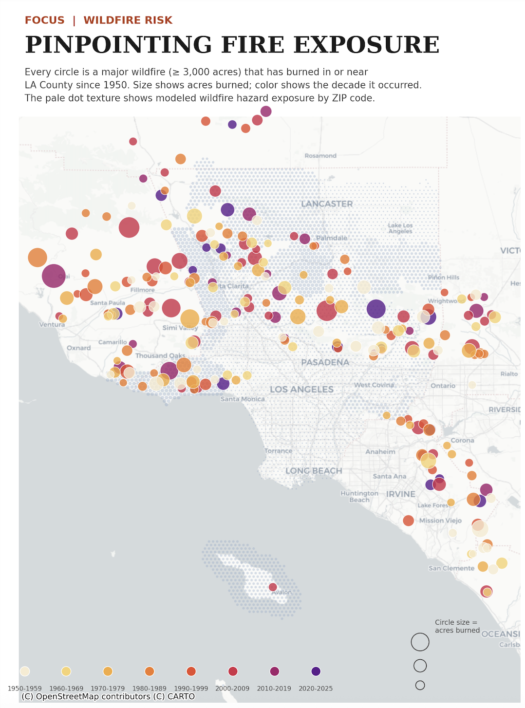
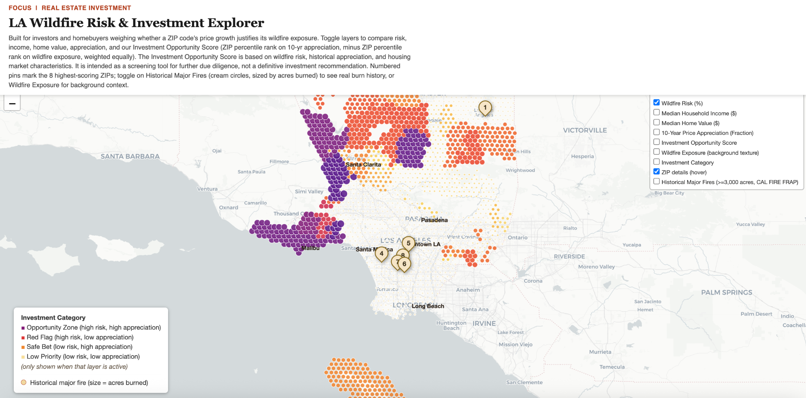
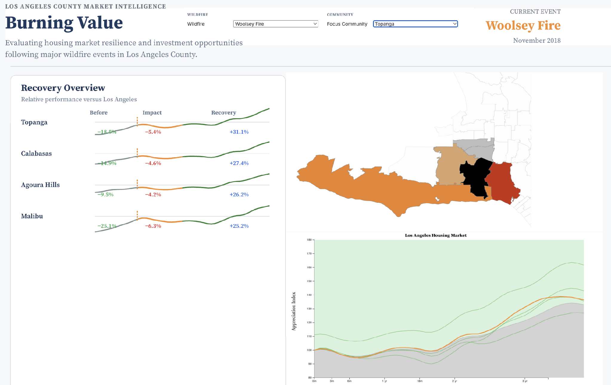
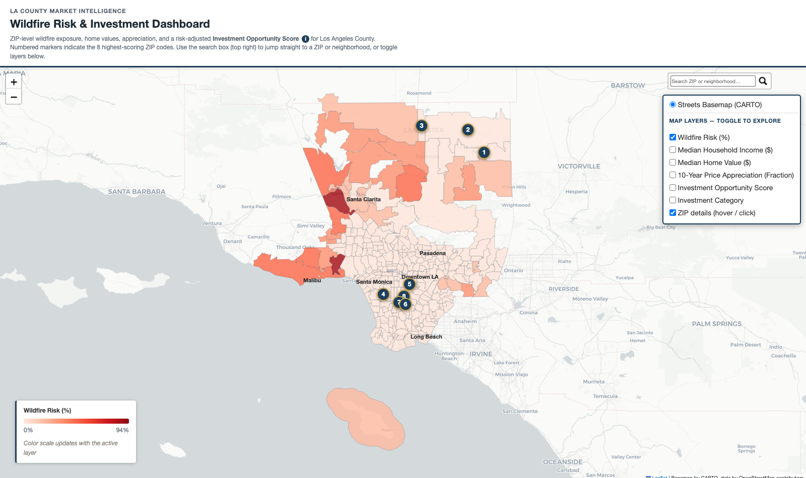
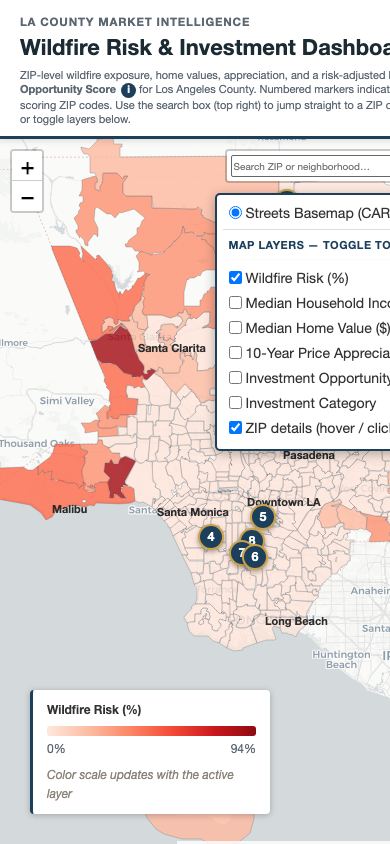

# Design Process & Change Log

This documents how the LA Wildfire Risk & Investment dashboard changed between the midterm
submission and the final version in [`LAFiresFinalProject.ipynb`](../LAFiresFinalProject.ipynb),
and why each change was made. The "after" state also folds in fixes and additions driven directly
by our own usability study (see [`usability_study_summary.md`](../usability_study_summary.md)).

## Midterm snapshots, for reference

| Iteration 1 — static wildfire map | Iteration 2/3 — hex-dot Investment Explorer |
|---|---|
|  |  |

We also prototyped a third, visually distinct direction in Observable (a recovery-timeline focused
layout, "Burning Value") that was not carried forward — the risk/appreciation/investment-score
framing of the Investment Explorer tested better with our target users and became the basis for
everything downstream:

## Final snapshot, for reference

| Desktop | Mobile |
|---|---|
|  |  |

## Change log

| # | Before | After | Why |
|---|---|---|---|
| 1 | Hex-dot texture map, editorial/data-journalism styling (bright cream/purple/orange/red palette) | Smooth ZIP-boundary choropleth with a muted navy/teal/burgundy/gray palette | Reads as a trustworthy market-intelligence tool rather than an infographic — closer to what Zillow/Redfin/a real estate firm's internal tool looks like, which is who several of our usability-study participants said they were evaluating it as (see Participants 3, 4, 8) |
| 2 | The color legend was only ever correct for whichever layer happened to be the default (Wildfire Risk); switching to any of the other 4 metric layers left either no legend or a legend for the wrong metric (verified in our own midterm screenshots — see `before_income_layer_stale_legend.png`, where "Median Household Income" is toggled on but the legend still reads "Wildfire Risk (%)") | A single legend panel that re-renders to match whichever layer is actually active, for all 5 metrics plus the Investment Category swatches | This was a real, reproducible bug present since the midterm build, not just a cosmetic nice-to-have — a color scale that doesn't match what's on screen actively misleads a user rather than just being unhelpful |
| 3 | The Investment Opportunity Score was explained in one dense paragraph in the header, which several usability testers read past without absorbing | A one-click ⓘ icon next to the term itself expands a short, plain-language explanation in place | Directly answers our usability study's #1 "Must Have" finding — multiple participants could see the score but not explain how it was derived (Participants 1 and 6 both asked "how exactly is this calculated?") |
| 4 | Layer control was a default-sized, unlabeled checkbox list that participants sometimes scrolled past entirely | Enlarged, bordered, and explicitly labeled "MAP LAYERS — TOGGLE TO EXPLORE" | Addresses our usability study's #2 "Must Have" finding — Participant 1 needed ~20 seconds to find the Investment Category layer, and Participant 9 suggested improving legend/control visibility directly |
| 5 | No way to jump to a specific ZIP or neighborhood; users had to visually scan the whole county | Added a ZIP/neighborhood search box (top right) that zooms to a match on either ZIP digits or city name | Addresses a "Should Have" finding — Participant 3 explicitly asked for a search bar ("A search bar would make navigation faster") |
| 6 | Only the 8 numbered "Top Investment Picks" pins were clickable for details; the ZIP polygons themselves responded to hover only | ZIP polygons now support both hover (desktop) and click/tap popups with the same property-card detail as the pins | Addresses a "Should Have" finding — Participant 9 "attempted to click directly on ZIP code polygons before realizing only numbered markers were interactive" |
| 7 | The layer-switching JavaScript reacted to Leaflet's internal `overlayadd`/`overlayremove` events, which fire once per individual ZIP polygon as well as once for the whole layer; reacting to them by mutating layers from inside their own handler could leave two metrics' fills on at once or silently revert a switch (confirmed by instrumenting the map and clicking through it — see testing notes below) | Rewritten to react to the layer-control checkbox's own click event, after Leaflet's own add/remove for that one checkbox has already completed, then deterministically enforcing "exactly one active layer" ourselves | Makes "toggle a layer" a reliable interaction instead of an occasionally-flaky one — directly serves the Phase 1 checklist question "does every interaction have a purpose (and actually work)?" |
| 8 | The masthead's height was hardcoded (128px) for a desktop-width line wrap; on a narrow/mobile screen the description text wraps onto extra lines and the layer control rendered overlapping the masthead text | The map's top offset is now measured from the masthead's actual rendered height via JS (recalculated on resize), so the layout always stacks cleanly regardless of screen width | Found during mobile testing for this pass — the dashboard is meant to work for someone evaluating it on their phone, and an overlapping header/control was a hard blocker to reading either one |

## How row 2 and row 7 were verified (not just asserted)

- **Row 2** (stale legend): confirmed against our own midterm slide deck — `before_income_layer_stale_legend.png`
  is a screenshot we took at midterm time with "Median Household Income" checked, and the legend in
  that screenshot still reads "Wildfire Risk (%)". The bug was real and present from the start, not
  introduced later.
- **Row 7** (layer-switch reliability): reproduced by instrumenting the live map in a browser console —
  logging every `layeradd`/`layerremove`/`overlayadd`/`overlayremove` event showed a single checkbox
  click could trigger two full add/remove cycles that sometimes net out to *no visible change at all*
  (the newly-checked layer never actually rendered). Switched to a checkbox-click-driven approach and
  re-verified with the same instrumentation that exactly one layer is ever active after a click.
