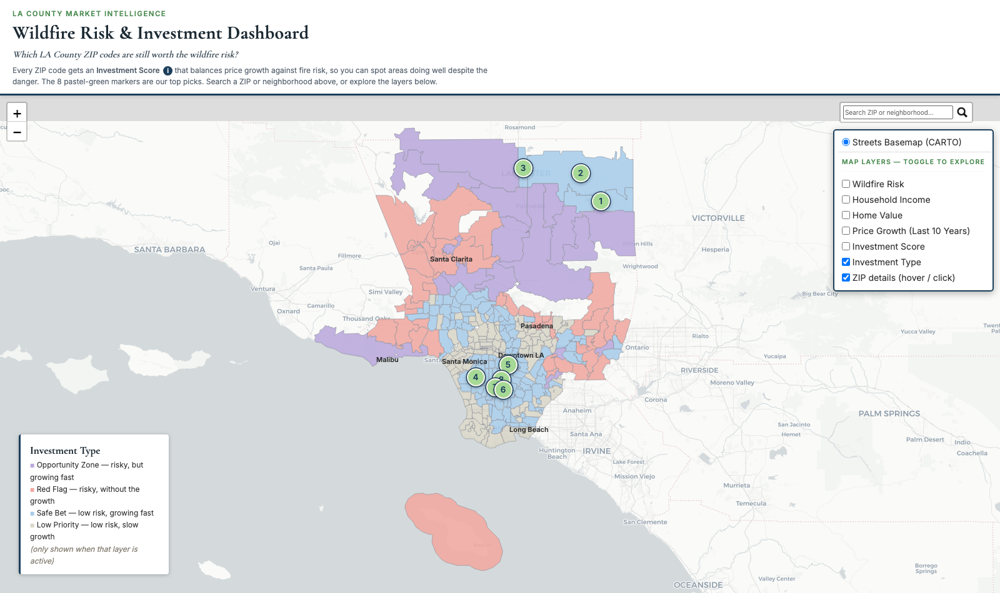

# Design Process & Change Log

This documents how the LA Wildfire Risk & Investment dashboard changed from the midterm
submission to the final version in [`LAFiresFinalProject.ipynb`](../LAFiresFinalProject.ipynb),
and why each change was made. The final state also folds in fixes driven by our own usability
study (see [`usability_study_summary.md`](../usability_study_summary.md)) and by auditing the
finished dashboard against our own "is this actually readable and does the narrative work"
checklist — a few of the rows below are bugs we found that way, not just style opinions.

## Midterm screenshots, for reference

| Iteration 1 — static wildfire map (no investment framing yet) | Iteration 2 — hex-dot Investment Explorer (midterm) |
|---|---|
|  |  |

We also prototyped a third, visually distinct direction in Observable (a recovery-timeline
focused layout, "Burning Value") that was not carried forward — the risk/appreciation/
investment-score framing of the Investment Explorer tested better with our target users and
became the basis for everything downstream:

## Current visualization, for reference

| Desktop | Mobile |
|---|---|
|  |  |

Investment Type layer (pastel palette, described in row 5 below):

## Change log

| # | Before | After | Why |
|---|---|---|---|
| 1 | Iteration 1 had no investment framing at all — just historical fire locations sized by acres burned, with no way to compare neighborhoods as opportunities | Added an **Investment Score** (price growth weighed against wildfire risk) and 8 ranked "Top Picks" markers | Stronger decision support — turns "here's where fires happened" into "here's where you should actually look first" |
| 2 | Hex-dot texture map, bright editorial palette (cream/purple/orange/red) — reads like a data-journalism graphic | Smooth ZIP-boundary choropleth, closer to a Zillow/Redfin-style market map | More context and more trustworthy for the audience actually evaluating it — several usability testers described it in exactly those terms ("something Zillow or Redfin could build") |
| 3 | Color legend was only ever correct for the default layer (Wildfire Risk); switching to any other metric left a stale or missing legend — confirmed as a real bug present since the midterm build, not something we introduced later (see `before_income_layer_stale_legend.png`: Household Income is checked, but the legend still reads "Wildfire Risk") | A single legend panel that re-renders to match whichever layer is actually active | Easier to interpret — a color scale that doesn't match what's on screen is worse than no legend, since it actively misleads instead of just being unhelpful |
| 4 | Dense, technical copy throughout: "10-Year Price Appreciation (Fraction)," "Investment Opportunity Score," percentile-rank formula spelled out in the header | Plain-language labels ("Price Growth," "Investment Score") and a one-click ⓘ explainer using everyday language | Directly answers our usability study's #1 finding — testers could see the score but not explain how it was derived, and said the dashboard needed to work "without me explaining it" |
| 5 | Dark, saturated "financial terminal" palette (navy/teal/burgundy/gray) for the Investment Category layer | Soft pastel palette (lavender/coral/sky-blue/sand) plus a matching pastel-green for the numbered pins | More approachable and friendlier on first impression, without losing legibility — verified the pastel pins still stay readable against every layer's colors, including the darkest ones |
| 6 | No way to search for a specific ZIP; only the 8 numbered pins were clickable, ZIP polygons responded to hover only | Added a ZIP/neighborhood search box, made ZIP polygons clickable (not just the pins), and enlarged/labeled the layer control | Better exploration — testers specifically asked for a search bar and expected to be able to click directly on ZIP polygons |
| 7 | Default system sans-serif (Helvetica Neue) throughout, same as any generic web page | A serif/sans pairing (Cormorant Garamond for headlines and legend titles, Inter for body copy and data) | Gives the dashboard a more polished, boutique real-estate feel instead of reading as a generic corporate report |
| 8 | Dashboard presented six togglable layers with no framing — left it to the user to figure out what question they were supposed to be answering | Masthead now opens with one explicit question ("Which LA County ZIP codes are still worth the wildfire risk?") that every layer exists to help answer | Gives the visualization a single clear narrative instead of open-ended, undirected exploration |

## Also fixed along the way (QA, not style)

A few issues surfaced only by testing the live map rather than reading the code, worth noting
since they were genuine bugs rather than opinions:

- **Layer-switch reliability**: the original exclusivity logic reacted to Leaflet's internal
  `overlayadd`/`overlayremove` events, which — confirmed by instrumenting the map in a browser
  console — could fire twice per click and occasionally leave a checkbox toggle with *no visible
  change at all*. Rewritten to react to the checkbox's own click event instead, and re-verified
  that exactly one layer is ever active after any click.
- **Mobile layout**: the masthead's height was hardcoded for desktop line-wrapping, so on a
  narrow screen the wrapped text overlapped the layer control. Fixed by measuring the masthead's
  actual rendered height in JS instead of assuming a fixed pixel value.
- **Pin numeral legibility**: zoomed into the numbered pins and found a bare "1" in the display
  serif font rendered as a plain vertical stroke, easily misread as a capital "I." The pin
  numerals now use a sans-serif face chosen for unambiguous digit shapes; the popup's "#1" was
  left as-is since the "#" already disambiguates it there.
- **Layer-control clarity**: the "ZIP details" toggle sits in the same checkbox list as the six
  mutually-exclusive metric/category layers but behaves differently (it's always on, independent
  of whichever layer is picked). Added a one-line caption so that isn't left to trial and error.
